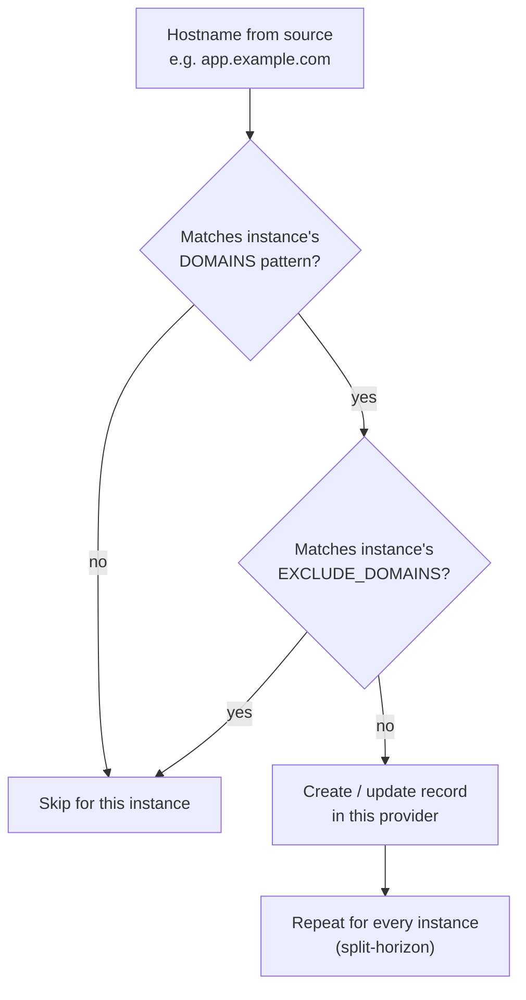

# Domain Matching

dnsweaver supports flexible domain matching with glob patterns, regex, and exclusions.

Each provider instance is evaluated **independently**: a hostname is first tested
against the instance's `DOMAINS` patterns, then filtered by its
`EXCLUDE_DOMAINS`. Because instances are independent, the same hostname can land
in several providers at once — this is what makes split-horizon DNS work.



## Glob Patterns

The default and simplest way to match domains:

```bash
# Match all subdomains of home.example.com
DNSWEAVER_INTERNAL_DNS_DOMAINS=*.home.example.com

# Match multiple patterns
DNSWEAVER_INTERNAL_DNS_DOMAINS=*.home.example.com,*.internal.example.com

# Exclude specific subdomains
DNSWEAVER_INTERNAL_DNS_EXCLUDE_DOMAINS=admin.home.example.com,secret.home.example.com
```

### Glob Pattern Examples

| Pattern | Matches | Doesn't Match |
|---------|---------|---------------|
| `*.example.com` | `app.example.com`, `foo.example.com` | `example.com`, `app.sub.example.com` |
| `*.*.example.com` | `app.sub.example.com` | `app.example.com` |
| `app-*.example.com` | `app-1.example.com`, `app-prod.example.com` | `my-app.example.com` |

## Regex Patterns

For complex matching requirements, use regex:

```bash
# Only lowercase alphanumeric subdomains
DNSWEAVER_INTERNAL_DNS_DOMAINS_REGEX=^[a-z0-9-]+\.home\.example\.com$

# Match multiple TLDs
DNSWEAVER_INTERNAL_DNS_DOMAINS_REGEX=^.*\.(example\.com|example\.org)$
```

!!! warning
    When using `DOMAINS_REGEX`, the `DOMAINS` variable is ignored for that instance.

## Multi-Provider Matching

When a hostname matches multiple providers, dnsweaver creates records in **all** matching providers. This is intentional for split-horizon DNS.

### Split-Horizon Example

```bash
DNSWEAVER_INSTANCES=internal-dns,public-dns

# Internal DNS: *.example.com → 192.0.2.100 (private IP)
DNSWEAVER_INTERNAL_DNS_DOMAINS=*.example.com
DNSWEAVER_INTERNAL_DNS_TARGET=192.0.2.100

# Public DNS: *.example.com → public.example.com (public CNAME)
DNSWEAVER_PUBLIC_DNS_DOMAINS=*.example.com
DNSWEAVER_PUBLIC_DNS_TARGET=public.example.com
```

With this configuration, `app.example.com` creates records in **both** providers:

- Internal DNS: `app.example.com → A → 192.0.2.100`
- Public DNS: `app.example.com → CNAME → public.example.com`

### Non-Overlapping Patterns

To route different subdomains to different providers:

```bash
# Internal only: *.internal.example.com
DNSWEAVER_INTERNAL_DNS_DOMAINS=*.internal.example.com

# Public only: *.example.com but NOT internal subdomains
DNSWEAVER_PUBLIC_DNS_DOMAINS=*.example.com
DNSWEAVER_PUBLIC_DNS_EXCLUDE_DOMAINS=*.internal.example.com
```

## Instance Order

The order of instances in `DNSWEAVER_INSTANCES` does **not** affect which providers receive records — all matching providers get records. However, instance order matters for:

1. **Logging**: Actions are logged in instance order
2. **Startup validation**: Providers are initialized in order

## Domain Migration

dnsweaver's domain matching makes it safe to migrate domains gradually. Containers with hostnames that don't match any provider patterns are simply ignored.

**Example: Migrating from `.lan` to `.local`**

```bash
# Provider configured for new domain only
DNSWEAVER_DNS_DOMAINS=*.home.local

# Container labels:
# - app.home.local     → ✅ Record created (matches)
# - app.home.lan       → ⏭️ Skipped (no match)
# - legacy.oldzone.lan → ⏭️ Skipped (no match)
```

This allows you to:

1. Deploy dnsweaver with new domain patterns
2. Migrate containers one at a time by updating their labels
3. Old-domain containers continue working with manually-managed DNS

!!! tip
    Run with `LOG_LEVEL=debug` to see "no matching providers for hostname" messages.
