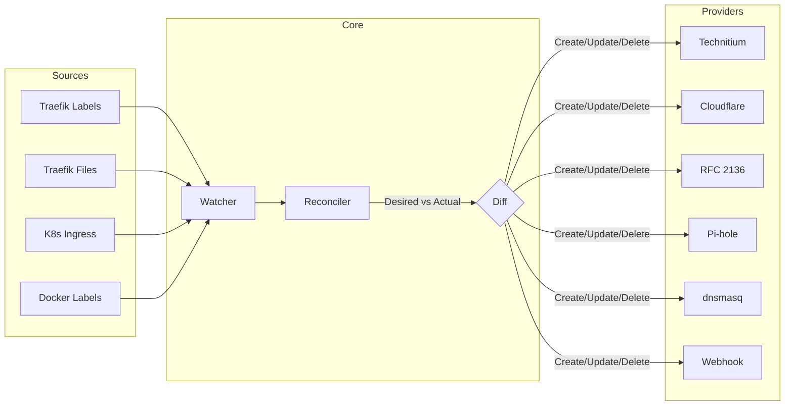

# Architecture

High-level overview of dnsweaver's architecture, data flow, and package structure. This document helps contributors understand how the codebase is organized and how the components interact.

## System Overview

dnsweaver is a DNS record lifecycle manager. It watches for service changes on container orchestration platforms (Docker, Kubernetes), discovers which hostnames those services declare, and creates or removes DNS records in one or more DNS providers to match.



## Data Flow

### 1. Discovery

Sources discover hostnames from workloads (Docker containers, Kubernetes resources) and static configuration files.

```
Platform Event (container start, Ingress create)
    → Platform Adapter (Docker client, K8s informer)
    → Workload (normalized representation)
    → Source.Extract() (parse labels/annotations)
    → []HostnameInfo (hostnames + metadata)
```

### 2. Reconciliation

The reconciler compares discovered hostnames (desired state) with existing DNS records (actual state) and determines what changes are needed.

```
Desired State (from Sources)  +  Actual State (from Provider.GetRecords())
    → Diff: records to create, update, delete
    → Ownership check: only modify records we own
    → Apply changes via Provider interface
    → Update metrics and log results
```

### 3. Record Lifecycle

```
Service deployed with DNS label
    → Source discovers hostname "app.example.com"
    → Reconciler creates A record pointing to service IP
    → Reconciler creates TXT ownership record (_dnsweaver.app.example.com)

Service removed
    → Source reports hostname gone from desired state
    → Reconciler finds orphaned record with matching ownership TXT
    → Reconciler deletes A record and ownership TXT
```

## Package Structure

```
dnsweaver/
├── cmd/dnsweaver/       # Application entry point and CLI
├── internal/            # Private application packages
│   ├── config/          # Configuration loading, validation, instance management
│   ├── docker/          # Docker platform adapter (API client, event watcher)
│   ├── health/          # HTTP health check endpoints (/healthz, /readyz)
│   ├── kubernetes/      # Kubernetes platform adapter (informers, RBAC)
│   ├── matcher/         # Domain glob matching (DOMAINS, EXCLUDE_DOMAINS)
│   ├── metrics/         # Prometheus metrics (counters, gauges, histograms)
│   ├── reconciler/      # Core reconciliation engine (diff, apply, ownership)
│   ├── testutil/        # Shared test utilities (mock providers, helpers)
│   └── watcher/         # Platform watcher orchestrator (events → reconciler)
├── pkg/                 # Public library packages (stable API)
│   ├── dnsupdate/       # RFC 2136 DNS update client (TSIG, zones)
│   ├── httputil/        # HTTP client utilities (retry, backoff)
│   ├── provider/        # Provider interface and types (Record, RecordType)
│   ├── source/          # Source interface and registry (Extract, Discover)
│   ├── sshutil/         # SSH/SFTP client utilities (connection, commands)
│   └── workload/        # Platform-agnostic workload types (Workload, Platform)
├── providers/           # Provider implementations (one per DNS service)
│   ├── cloudflare/      # Cloudflare API provider
│   ├── dnsmasq/         # dnsmasq file-based provider (local + SSH)
│   ├── pihole/          # Pi-hole v5 and v6 API provider
│   ├── rfc2136/         # RFC 2136 dynamic DNS update provider
│   ├── technitium/      # Technitium DNS API provider
│   └── webhook/         # Generic webhook provider (HTTP callbacks)
├── sources/             # Source implementations (one per discovery method)
│   ├── dnsweaver/       # Native Docker label source (dnsweaver.hostname)
│   ├── kubernetes/      # Kubernetes Ingress/Service annotation source
│   └── traefik/         # Traefik router rule parser (labels + files)
├── deploy/              # Deployment manifests (Helm, Kustomize, raw K8s)
├── docs/                # Documentation (MkDocs)
└── testdata/            # Test fixture files
```

### Key Boundaries

| Layer | Packages | Responsibility |
|-------|----------|----------------|
| **Entry** | `cmd/dnsweaver` | CLI flags, signal handling, wire up components |
| **Platform** | `internal/docker`, `internal/kubernetes` | Translate platform API events into `Workload` types |
| **Source** | `pkg/source`, `sources/*` | Extract hostnames from workloads and config files |
| **Core** | `internal/reconciler`, `internal/watcher`, `internal/matcher` | Orchestrate discovery → diff → apply loop |
| **Provider** | `pkg/provider`, `providers/*` | Create, update, delete DNS records in external systems |
| **Support** | `pkg/httputil`, `pkg/sshutil`, `pkg/dnsupdate` | Shared utilities for HTTP, SSH, and DNS operations |
| **Config** | `internal/config` | Load environment variables, validate, build instance configs |

## Core Interfaces

### Provider Interface

Every DNS provider implements this interface (defined in `pkg/provider`):

```go
type Provider interface {
    Name() string
    GetRecords(ctx context.Context) ([]Record, error)
    CreateRecord(ctx context.Context, record Record) error
    UpdateRecord(ctx context.Context, record Record) error
    DeleteRecord(ctx context.Context, record Record) error
    SupportsRecordType(rt RecordType) bool
}
```

Providers are stateless HTTP/file clients. They don't track what records they've created — that's the reconciler's job via ownership TXT records.

### Source Interface

Every hostname source implements this interface (defined in `pkg/source`):

```go
type Source interface {
    Name() string
    Extract(ctx context.Context, w workload.Workload) ([]HostnameInfo, error)
    Discover(ctx context.Context) ([]HostnameInfo, error)
}
```

- `Extract()` parses hostnames from a single workload's labels/annotations
- `Discover()` scans static configuration files for hostnames

### Workload Type

The `pkg/workload.Workload` struct is the universal representation of any platform resource:

```go
type Workload struct {
    ID          string
    Name        string
    Namespace   string
    Labels      map[string]string
    Annotations map[string]string
    Platform    Platform    // "docker", "kubernetes", "static"
    Kind        Kind        // "container", "service", "ingress", etc.
    Hostnames   []string
    Addresses   []Address
}
```

Platform adapters (Docker client, K8s informer) convert native resources into this type before passing them to sources.

## Configuration Model

dnsweaver uses a multi-instance configuration model. Each instance binds one provider to specific domain patterns and record types.

```
DNSWEAVER_INSTANCES=internal-dns,cloudflare

# Instance: internal-dns
DNSWEAVER_INTERNAL_DNS_TYPE=technitium
DNSWEAVER_INTERNAL_DNS_DOMAINS=*.home.example.com
DNSWEAVER_INTERNAL_DNS_RECORD_TYPE=A

# Instance: cloudflare
DNSWEAVER_CLOUDFLARE_TYPE=cloudflare
DNSWEAVER_CLOUDFLARE_DOMAINS=*.example.com
DNSWEAVER_CLOUDFLARE_RECORD_TYPE=CNAME
```

### Loading Flow

```
Environment Variables
    → internal/config.LoadConfig()
    → Parse DNSWEAVER_INSTANCES
    → For each instance:
        → Load instance-specific vars (TYPE, DOMAINS, TARGET, etc.)
        → Apply _FILE suffix resolution (Docker secrets)
        → Validate required fields
        → Create provider via providers/<type>.New()
    → Create reconciler with all provider instances
    → Create watcher with platform adapters
    → Start event loop
```

## Reconciliation Algorithm

The reconciler follows a three-phase approach:

### Phase 1: Collect State

1. Query all sources for current desired hostnames
2. Query all providers for current DNS records
3. Filter provider records to only those matching configured domains

### Phase 2: Compute Diff

For each desired hostname:

- **No existing record** → Create (+ ownership TXT)
- **Existing record with different target** → Update
- **Existing record with matching target** → No-op

For each existing owned record not in desired state:

- **Has ownership TXT matching our instance** → Delete (orphan cleanup)
- **No ownership TXT** → Skip (not our record)

### Phase 3: Apply Changes

1. Apply all creates
2. Apply all updates
3. Apply all deletes (orphan cleanup)
4. Update Prometheus metrics
5. Log summary of changes

### Ownership Tracking

dnsweaver uses TXT records to track which DNS records it manages:

```
# For hostname "app.example.com":
_dnsweaver.app.example.com  TXT  "heritage=dnsweaver,instance=internal-dns"
```

This prevents dnsweaver from deleting manually-created records and enables multi-instance coordination where multiple dnsweaver instances manage different domains on the same DNS server.

## Concurrency Model

- **Watcher**: Single goroutine per platform, receives events and triggers reconciliation
- **Reconciler**: Serialized — only one reconciliation runs at a time (mutex-protected)
- **Providers**: Concurrent reads allowed, writes serialized per instance
- **Sources**: Stateless, safe for concurrent use

## Health and Observability

- **Health endpoints**: `/healthz` (liveness), `/readyz` (readiness) via `internal/health`
- **Metrics**: Prometheus metrics at `/metrics` via `internal/metrics` — records created/updated/deleted, reconcile duration, provider errors
- **Logging**: Structured JSON logging via `log/slog` — all operations include provider name, hostname, record type context
