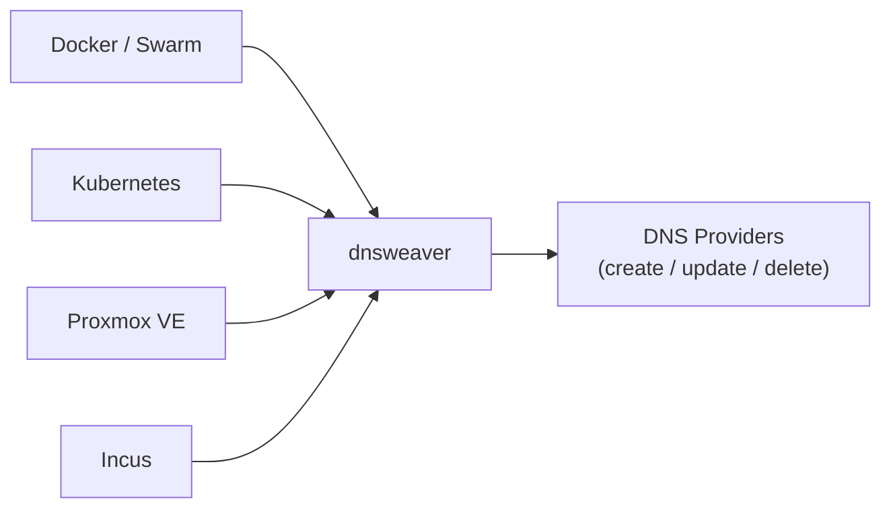

# dnsweaver

**Automatic DNS management for Docker, Kubernetes, and Proxmox VE workloads with multi-provider support.**

dnsweaver watches Docker events, Kubernetes resources, and Proxmox VE clusters to automatically create and delete DNS records. Unlike single-provider or single-platform tools, dnsweaver supports **split-horizon DNS**, **multiple DNS providers** simultaneously, and works across **Docker**, **Docker Swarm**, **Kubernetes**, and **Proxmox VE** — or all of them at once.

---

## Key Features

<div class="grid cards" markdown>

-   :material-dns:{ .lg .middle } **Multi-Provider Support**

    ---

    Route different domains to different DNS providers. Nine providers: Technitium, Cloudflare, OVHcloud, AdGuard Home, RFC 2136, PowerDNS, Pi-hole, dnsmasq, and webhook.

    [:octicons-arrow-right-24: Providers](providers/index.md)

-   :material-sync:{ .lg .middle } **Split-Horizon DNS**

    ---

    Create internal and external records from the same container labels automatically. One label, multiple zones.

    [:octicons-arrow-right-24: Split-Horizon Guide](deployment/split-horizon.md)

-   :material-docker:{ .lg .middle } **Docker, Swarm & Kubernetes**

    ---

    First-class support for Docker, Docker Swarm, and Kubernetes. Run on one platform or all three simultaneously.

    [:octicons-arrow-right-24: Sources Overview](sources/index.md)

-   :material-server:{ .lg .middle } **Proxmox VE**

    ---

    Auto-creates A records for VMs and LXC containers by polling the PVE API. Filter by node, tag, or VM state.

    [:octicons-arrow-right-24: Proxmox Source](sources/proxmox.md)

-   :material-cube-outline:{ .lg .middle } **Incus**

    ---

    Auto-creates A records for Incus system containers and VMs over a local socket or remote HTTPS.

    [:octicons-arrow-right-24: Incus Source](sources/incus.md)

-   :material-chart-line:{ .lg .middle } **Observable**

    ---

    Prometheus metrics, health endpoints, and structured logging built-in. Know what's happening.

    [:octicons-arrow-right-24: Observability](observability.md)

</div>

## How It Works



=== "Docker / Swarm"

    1. A container starts with a Traefik label:

        ```yaml
        labels:
          - "traefik.http.routers.myapp.rule=Host(`myapp.home.example.com`)" # (1)!
        ```

        1. dnsweaver extracts hostnames from Traefik router labels and native `dnsweaver.*` labels

    2. dnsweaver extracts the hostname and matches it against configured provider domain patterns

    3. The matching provider creates the DNS record:
        - **A record**: `myapp.home.example.com → 192.0.2.100`
        - **CNAME**: `myapp.example.com → proxy.example.com`

    4. When the container stops, the DNS record is automatically cleaned up

=== "Kubernetes"

    1. An Ingress, IngressRoute, HTTPRoute, or annotated Service is created:

        ```yaml
        apiVersion: networking.k8s.io/v1
        kind: Ingress
        metadata:
          name: myapp
        spec:
          rules:
            - host: myapp.home.example.com # (1)!
        ```

        1. dnsweaver watches Ingress, IngressRoute (Traefik CRD), HTTPRoute (Gateway API), and Service resources

    2. dnsweaver extracts the hostname and matches it against configured provider domain patterns

    3. The matching provider creates the DNS record:
        - **A record**: `myapp.home.example.com → 192.0.2.100`
        - **CNAME**: `myapp.example.com → proxy.example.com`

    4. When the resource is deleted, the DNS record is automatically cleaned up

=== "Proxmox VE"

    1. A VM or LXC container is running with a QEMU guest agent (or LXC network configured):

        ```bash
        # VM example: qm set 100 --name myvm --tags web # (1)!
        ```

        1. dnsweaver polls the PVE API and discovers VMs via QEMU guest agent IPs or LXC container IPs from net0 config

    2. dnsweaver extracts the VM or LXC hostname and IP, then matches against configured provider domain patterns

    3. The matching provider creates the DNS record:
        - **A record**: `myvm.home.example.com → 192.0.2.10`

    4. When the VM or LXC is stopped or deleted, the DNS record is automatically cleaned up

=== "Incus"

    1. An Incus system container or VM is running with a resolvable IP:

        ```bash
        # Example: incus launch images:debian/12 myinstance # (1)!
        ```

        1. dnsweaver polls the Incus API (local socket or remote HTTPS) and discovers instances via their network state

    2. dnsweaver extracts the instance hostname and IP, then matches against configured provider domain patterns

    3. The matching provider creates the DNS record:
        - **A record**: `myinstance.home.example.com → 192.0.2.20`

    4. When the instance is stopped or deleted, the DNS record is automatically cleaned up

## Quick Start

=== "Docker Compose"

    ```yaml
    services:
      dnsweaver:
        image: maxamill/dnsweaver:latest
        environment:
          - DNSWEAVER_INSTANCES=internal-dns # (1)!
          - DNSWEAVER_INTERNAL_DNS_TYPE=technitium # (2)!
          - DNSWEAVER_INTERNAL_DNS_URL=http://dns.internal:5380
          - DNSWEAVER_INTERNAL_DNS_TOKEN_FILE=/run/secrets/technitium_token
          - DNSWEAVER_INTERNAL_DNS_ZONE=home.example.com
          - DNSWEAVER_INTERNAL_DNS_RECORD_TYPE=A
          - DNSWEAVER_INTERNAL_DNS_TARGET=192.0.2.100 # (3)!
          - DNSWEAVER_INTERNAL_DNS_DOMAINS=*.home.example.com # (4)!
        volumes:
          - /var/run/docker.sock:/var/run/docker.sock:ro
        secrets:
          - technitium_token
    ```

    1. Comma-separated list of provider instance names
    2. Provider type: `technitium`, `cloudflare`, `pihole`, `adguard`, `dnsmasq`, `rfc2136`, or `webhook`
    3. Target IP for A records (or CNAME target hostname)
    4. Domain patterns to match—wildcards supported

=== "Kubernetes (Helm)"

    ```bash
    helm install dnsweaver oci://ghcr.io/maxfield-allison/charts/dnsweaver \
      --namespace dnsweaver --create-namespace \
      --set config.instances="internal-dns" \
      --set config.providers.internal-dns.type=technitium \
      --set config.providers.internal-dns.url=http://dns.internal:5380 \
      --set config.providers.internal-dns.zone=home.example.com \
      --set config.providers.internal-dns.recordType=A \
      --set config.providers.internal-dns.target=192.0.2.100 \
      --set config.providers.internal-dns.domains="*.home.example.com"
    ```

=== "Kubernetes (Kustomize)"

    ```bash
    kubectl apply -k https://github.com/maxfield-allison/dnsweaver/deploy/kustomize/base
    ```

    Then configure via ConfigMap and Secret. See the [Kubernetes deployment guide](deployment/kubernetes.md).

[:octicons-arrow-right-24: Getting Started](getting-started.md){ .md-button .md-button--primary }
[:octicons-arrow-right-24: Configuration](configuration/environment.md){ .md-button }

## Supported Providers

<div class="grid" markdown>

| Provider | Record Types | Notes |
| :------- | :----------- | :---- |
| [Technitium](providers/technitium.md) | A, AAAA, CNAME, SRV, TXT | Full-featured self-hosted DNS |
| [Cloudflare](providers/cloudflare.md) | A, AAAA, CNAME, SRV, TXT | With optional proxy support |
| [OVHcloud](providers/ovh.md) | A, AAAA, CNAME, SRV, TXT | Public DNS for OVH-hosted domains |
| [RFC 2136](providers/rfc2136.md) | A, AAAA, CNAME, SRV, TXT | BIND, Windows DNS, PowerDNS, Knot |
| [PowerDNS](providers/powerdns.md) | A, AAAA, CNAME, SRV, TXT | Native Authoritative HTTP API |
| [Pi-hole](providers/pihole.md) | A, CNAME | API or file mode |
| [AdGuard Home](providers/adguard.md) | A, AAAA, CNAME | DNS rewrite management |
| [dnsmasq](providers/dnsmasq.md) | A, CNAME | File-based configuration |
| [Webhook](providers/webhook.md) | A, AAAA, CNAME, TXT | Custom integrations |

</div>

---

## Why dnsweaver?

| | dnsweaver | external-dns | docker-dns-gen |
| :--- | :---: | :---: | :---: |
| Docker support | :material-check: | :material-close: | :material-check: |
| Kubernetes support | :material-check: | :material-check: | :material-close: |
| Proxmox VE support | :material-check: | :material-close: | :material-close: |
| Incus support | :material-check: | :material-close: | :material-close: |
| Multiple providers | :material-check: | :material-close: | :material-close: |
| Split-horizon DNS | :material-check: | :material-close: | :material-close: |
| Self-hosted DNS focus | :material-check: | :material-close: | :material-close: |
| No CRDs required | :material-check: | :material-close: | N/A |

## Next Steps

<div class="grid cards" markdown>

-   :material-rocket-launch:{ .lg .middle } **Getting Started**

    ---

    Install and configure dnsweaver in minutes — Docker or Kubernetes.

    [:octicons-arrow-right-24: Quick Start Guide](getting-started.md)

-   :material-cog:{ .lg .middle } **Configuration**

    ---

    Environment variables, YAML config, and secrets reference.

    [:octicons-arrow-right-24: Configuration Docs](configuration/environment.md)

-   :material-server:{ .lg .middle } **Deployment Guides**

    ---

    Production-ready configs for Docker Compose, Swarm, and Kubernetes.

    [:octicons-arrow-right-24: Deployment](deployment/index.md)

-   :material-transit-connection-variant:{ .lg .middle } **Split-Horizon DNS**

    ---

    Internal + external records from one config.

    [:octicons-arrow-right-24: Split-Horizon Guide](deployment/split-horizon.md)

</div>
