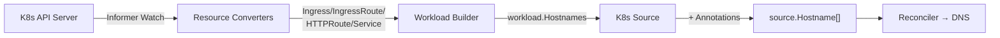

# Kubernetes Source

The Kubernetes source extracts hostnames from Kubernetes networking resources. It works with the Kubernetes watcher to automatically detect DNS-relevant hostnames from your cluster workloads.

## How It Works



1. **Informer-based watcher** monitors K8s resources via the API server
2. **Resource converters** extract hostnames from each resource type's spec
3. **K8s source** reads the pre-extracted hostnames and applies annotation-based RecordHints
4. **Reconciler** matches hostnames to DNS providers and creates/updates records

## Supported Resources

| Resource | API Group | Version | Hostname Source |
| :------- | :-------- | :------ | :-------------- |
| Ingress | `networking.k8s.io` | `v1` | `.spec.rules[].host` |
| IngressRoute | `traefik.io` | `v1alpha1` | `Host()` matcher in `.spec.routes[].match` |
| HTTPRoute | `gateway.networking.k8s.io` | `v1` | `.spec.hostnames[]` |
| Service | _(core)_ | `v1` | LoadBalancer ingress hostnames, ExternalName |

## Configuration

Enable the Kubernetes source in your config:

```yaml
platform: kubernetes  # or "both" for Docker + K8s

sources:
  - name: dnsweaver    # Native dnsweaver.dev/* annotation labels
  - name: kubernetes   # K8s hostname extraction from resource specs
```

Or via environment variables:

```bash
DNSWEAVER_PLATFORM=kubernetes
DNSWEAVER_SOURCE=dnsweaver,kubernetes
```

## Annotations

The Kubernetes source reads `dnsweaver.dev/*` annotations from resources to override DNS record behavior:

### Reference

| Annotation | Type | Default | Description |
| :--------- | :--- | :------ | :---------- |
| `dnsweaver.dev/enabled` | `bool` | `true` | Set to `"false"` to skip this resource entirely |
| `dnsweaver.dev/record-type` | `string` | _(from provider)_ | Override record type: `A`, `AAAA`, `CNAME`, `SRV` |
| `dnsweaver.dev/target` | `string` | _(from provider)_ | Override DNS target (IP or hostname) |
| `dnsweaver.dev/ttl` | `int` | _(from provider)_ | Override TTL in seconds |
| `dnsweaver.dev/provider` | `string` | _(auto-matched)_ | Route to a specific DNS provider by name |
| `dnsweaver.dev/proxied` | `bool` | _(from provider)_ | Enable Cloudflare proxy for this record |

### Behavior

- **Annotations are optional** — resources without annotations are processed normally using provider defaults
- **`dnsweaver.dev/enabled`** defaults to `true` when absent; explicitly set `"false"` to exclude a resource
- **RecordHints are per-hostname** — all hostnames from a resource inherit the same annotations
- **Provider matching** — if `dnsweaver.dev/provider` is set, only that provider handles the record; otherwise, normal domain-matching applies
- **Multiple sources** — if both `dnsweaver` and `kubernetes` sources are enabled, annotations are processed by both (the dnsweaver source converts `dnsweaver.dev/*` annotations to its native label format)

### Examples

#### Standard Ingress (no annotations needed)

```yaml
apiVersion: networking.k8s.io/v1
kind: Ingress
metadata:
  name: my-app
spec:
  rules:
    - host: app.example.com
      http:
        paths:
          - path: /
            pathType: Prefix
            backend:
              service:
                name: my-app
                port:
                  number: 80
```

dnsweaver automatically extracts `app.example.com` and creates a DNS record using the matching provider's defaults.

#### Override Target and Provider

```yaml
apiVersion: traefik.io/v1alpha1
kind: IngressRoute
metadata:
  name: internal-app
  annotations:
    dnsweaver.dev/target: "10.0.0.100"
    dnsweaver.dev/provider: "internal-dns"
    dnsweaver.dev/record-type: "A"
spec:
  entryPoints:
    - websecure
  routes:
    - match: Host(`app.internal.home.example.com`)
      kind: Rule
      services:
        - name: internal-app
          port: 80
```

#### Disable for a Specific Resource

```yaml
apiVersion: networking.k8s.io/v1
kind: Ingress
metadata:
  name: excluded-app
  annotations:
    dnsweaver.dev/enabled: "false"
spec:
  rules:
    - host: skip.example.com
      # ...
```

#### Cloudflare Proxy

```yaml
apiVersion: networking.k8s.io/v1
kind: Ingress
metadata:
  name: public-app
  annotations:
    dnsweaver.dev/provider: "cloudflare"
    dnsweaver.dev/proxied: "true"
    dnsweaver.dev/record-type: "CNAME"
    dnsweaver.dev/target: "lb.example.com"
spec:
  rules:
    - host: public.example.com
      # ...
```

## Router Attribution

Each extracted hostname includes a router identifier for debugging and ownership tracking:

| Resource Type | Router Format | Example |
| :------------ | :------------ | :------ |
| Ingress | `Ingress:namespace/name` | `Ingress:default/my-app` |
| IngressRoute | `IngressRoute:namespace/name` | `IngressRoute:traefik/dashboard` |
| HTTPRoute | `HTTPRoute:namespace/name` | `HTTPRoute:gateway/api-route` |
| Service | `Service:namespace/name` | `Service:default/my-svc` |

## Filtering

### Namespace Filter

Limit watching to specific namespaces:

```yaml
kubernetes:
  namespaces: "production,staging"
```

### Label Selector

Only process resources matching a label selector:

```yaml
kubernetes:
  label_selector: "app.kubernetes.io/managed-by=helm"
```

### Annotation Filter

Only process resources with a specific annotation:

```yaml
kubernetes:
  annotation_filter: "dnsweaver.dev/enabled=true"
```

!!! note "Annotation filter vs dnsweaver.dev/enabled"
    The `annotation_filter` config filters at the **watcher level** (resources without the annotation are never seen). The `dnsweaver.dev/enabled` annotation filters at the **source level** (resources are watched but skipped during extraction). Use `annotation_filter` for hard opt-in; use `dnsweaver.dev/enabled: "false"` for selective opt-out.
