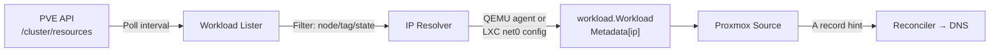

# Proxmox VE Source

The Proxmox VE source creates DNS A records for running VMs and LXC containers on your Proxmox cluster. It polls the PVE API to discover workloads and resolves each resource's IP address — via the QEMU guest agent (VMs) or the LXC network configuration — then registers an A record mapping `<vm-name>.<domain>` to that IP.

## How It Works



1. **Lister** polls `/cluster/resources` and applies node, tag, and state filters
2. **IP resolver** calls the QEMU guest agent for VMs, or parses `net0` config for LXC containers
3. **Source** maps the VM name + configured domain suffix to a fully-qualified hostname
4. **Reconciler** creates or updates A records via the matching DNS provider

## Configuration

### Environment Variables

| Variable | Required | Default | Description |
| :------- | :------- | :------ | :---------- |
| `DNSWEAVER_PROXMOX_URL` | **Yes** | — | PVE API base URL, e.g. `https://pve-00:8006` |
| `DNSWEAVER_PROXMOX_TOKEN_ID` | **Yes** | — | API token ID, e.g. `root@pam!dnsweaver` |
| `DNSWEAVER_PROXMOX_TOKEN_SECRET` | **Yes** | — | API token secret (UUID). Supports `_FILE` suffix. |
| `DNSWEAVER_PROXMOX_TOKEN_SECRET_FILE` | Alt | — | Path to a file containing the token secret (Docker secrets) |
| `DNSWEAVER_PROXMOX_VERIFY_TLS` | No | `false` | Set `true` to verify the PVE API TLS certificate |
| `DNSWEAVER_PROXMOX_NODE_FILTER` | No | _(all nodes)_ | Restrict discovery to a single PVE node name |
| `DNSWEAVER_PROXMOX_TAG_FILTER` | No | _(all tags)_ | Only include resources with this tag (prefix match) |
| `DNSWEAVER_PROXMOX_STATE_FILTER` | No | `running` | PVE resource status filter (`running`, `stopped`, etc.) |
| `DNSWEAVER_PROXMOX_DOMAIN_SUFFIX` | No | — | Domain suffix appended to VM names, e.g. `home.example.com` |

### Source Registration

Add `proxmox` to `DNSWEAVER_SOURCES`:

```bash
DNSWEAVER_SOURCES=proxmox
```

!!! tip "Auto-registration"
    When `DNSWEAVER_PROXMOX_URL` is set, the Proxmox source is **automatically registered**
    even if not listed in `DNSWEAVER_SOURCES`. You only need to list it explicitly if
    you want to control source ordering relative to other sources.

## Hostname Resolution

The source determines the DNS hostname for each workload using this logic:

1. **VM name contains a dot** — used directly as an FQDN (e.g., `webserver.home.example.com`)
2. **Domain suffix configured** — appended to the VM name (e.g., `webserver` + `home.example.com` → `webserver.home.example.com`)
3. **Neither condition** — the workload is skipped; a debug log entry is emitted

!!! warning "Domain suffix is strongly recommended"
    Without a domain suffix, only VMs whose names already contain a dot will
    produce DNS records. Set `DNSWEAVER_PROXMOX_DOMAIN_SUFFIX` to ensure all
    workloads are registered.

## IP Address Resolution

IP resolution differs by resource type:

| Type | Method | Notes |
| :--- | :----- | :---- |
| **VM (QEMU)** | QEMU guest agent (`/agent/network-get-interfaces`) | Requires `qemu-guest-agent` installed and running in the VM |
| **LXC container** | `net0` config field (`ip=<address>/prefix`) | Reads directly from the PVE API; no agent required |

VMs without a running guest agent are skipped (a debug log entry is emitted). To include VMs, install and enable `qemu-guest-agent` inside the guest.

## PVE API Token

dnsweaver requires a token with **read-only** permissions covering both VM
listing and the QEMU guest agent. The built-in `PVEAuditor` role is **not
sufficient** on its own — it grants `VM.Audit` (lists VMs) but not
`VM.Monitor` (queries the guest agent for IP addresses). Without `VM.Monitor`,
VM IP resolution returns `403 Permission check failed` and only LXC containers
get DNS records.

Create a dedicated minimal role and bind it to a token:

```bash
# On any PVE node (or via Datacenter → Permissions → Roles in the web UI)
pveum role add DNSWeaver -privs "VM.Audit,VM.Monitor,Pool.Audit"
pveum user add dnsweaver@pve --comment "dnsweaver read-only"
pveum aclmod / -user dnsweaver@pve -role DNSWeaver
pveum user token add dnsweaver@pve dnsweaver --privsep=0
```

| Privilege | Why it is required |
| :-------- | :----------------- |
| `VM.Audit` | List VMs and LXC containers via `/cluster/resources` |
| `VM.Monitor` | Query the QEMU guest agent (`/agent/network-get-interfaces`) for VM IPs |
| `Pool.Audit` | Required for `/cluster/resources` to enumerate pool-scoped resources |

The token ID format is `<user>@<realm>!<tokenname>`, for example:
`dnsweaver@pve!dnsweaver`

!!! note "Privilege separation"
    `--privsep=0` propagates the user's role to the token directly. If you set
    `--privsep=1`, you must also explicitly grant the role to the token itself
    via `pveum aclmod / -token 'dnsweaver@pve!dnsweaver' -role DNSWeaver` —
    otherwise the token will have no permissions.

!!! tip "Verify the token"
    Confirm the token has the expected privileges:

    ```bash
    pveum user token permissions dnsweaver@pve dnsweaver --path /
    # Expect: Pool.Audit, VM.Audit, VM.Monitor
    ```

## Workload Labels

The Proxmox source exposes PVE tags as workload labels with the prefix `proxmox.tag/`.
For example, a VM tagged `web` will have the label `proxmox.tag/web=true`.

These labels are available for filtering and can be used to route records to specific
DNS providers via provider label selectors (if supported by your provider configuration).

## Example: Docker Compose

```yaml
services:
  dnsweaver:
    image: ghcr.io/maxfield-allison/dnsweaver:latest
    environment:
      DNSWEAVER_SOURCES: proxmox
      DNSWEAVER_PROXMOX_URL: https://pve-00.home.example.com:8006
      DNSWEAVER_PROXMOX_TOKEN_ID: dnsweaver@pve!dnsweaver
      DNSWEAVER_PROXMOX_TOKEN_SECRET_FILE: /run/secrets/pve_token
      DNSWEAVER_PROXMOX_VERIFY_TLS: "true"
      DNSWEAVER_PROXMOX_DOMAIN_SUFFIX: home.example.com
      DNSWEAVER_PROXMOX_TAG_FILTER: dnsweaver
    secrets:
      - pve_token

secrets:
  pve_token:
    file: ./secrets/pve_token.txt
```

## Example: Kubernetes Secret

```yaml
apiVersion: v1
kind: Secret
metadata:
  name: dnsweaver-proxmox
  namespace: dnsweaver
type: Opaque
stringData:
  token-secret: "<your-token-secret>"
---
apiVersion: apps/v1
kind: Deployment
metadata:
  name: dnsweaver
  namespace: dnsweaver
spec:
  template:
    spec:
      containers:
        - name: dnsweaver
          env:
            - name: DNSWEAVER_SOURCES
              value: proxmox
            - name: DNSWEAVER_PROXMOX_URL
              value: https://pve-00.home.example.com:8006
            - name: DNSWEAVER_PROXMOX_TOKEN_ID
              value: dnsweaver@pve!dnsweaver
            - name: DNSWEAVER_PROXMOX_TOKEN_SECRET
              valueFrom:
                secretKeyRef:
                  name: dnsweaver-proxmox
                  key: token-secret
            - name: DNSWEAVER_PROXMOX_VERIFY_TLS
              value: "true"
            - name: DNSWEAVER_PROXMOX_DOMAIN_SUFFIX
              value: home.example.com
```

## Filtering Workloads

### By Node

Only include resources from a specific PVE node:

```bash
DNSWEAVER_PROXMOX_NODE_FILTER=pve-00
```

### By Tag

Only include resources that have a specific tag (prefix match):

```bash
# Include only resources tagged with "dnsweaver" (or any tag starting with "dnsweaver")
DNSWEAVER_PROXMOX_TAG_FILTER=dnsweaver
```

Tag resources in PVE under `Options → Tags` in the web UI, or via the API:

```bash
pvesh set /nodes/pve-00/qemu/100/config --tags dnsweaver
```

### By State

Only include resources in a specific state (default: `running`):

```bash
DNSWEAVER_PROXMOX_STATE_FILTER=running
```

## Troubleshooting

### VM has no resolved IP

- Ensure `qemu-guest-agent` is installed and running inside the VM
- Check with: `pvesh get /nodes/<node>/qemu/<vmid>/agent/network-get-interfaces`
- If the agent is not available, the VM is silently skipped (check debug logs)

### TLS certificate errors

If the PVE API uses a self-signed certificate (common in homelabs):

```bash
DNSWEAVER_PROXMOX_VERIFY_TLS=false  # default; accepts self-signed certs
```

To enforce certificate verification with a valid cert:

```bash
DNSWEAVER_PROXMOX_VERIFY_TLS=true
```

### No records created

1. Verify `DNSWEAVER_PROXMOX_URL` is reachable from dnsweaver
2. Confirm the token has `VM.Audit`, `VM.Monitor`, and `Pool.Audit` via:
   `pveum user token permissions dnsweaver@pve dnsweaver --path /`
3. Check that VMs are in the `running` state (or adjust `DNSWEAVER_PROXMOX_STATE_FILTER`)
4. Confirm `DNSWEAVER_PROXMOX_DOMAIN_SUFFIX` is set if VM names are not already FQDNs
5. Enable debug logging: `DNSWEAVER_LOG_LEVEL=debug`

### Only LXC records appear, no VMs

This is the classic symptom of a missing `VM.Monitor` privilege. LXC IPs are
read directly from the PVE config (covered by `VM.Audit`), but VM IPs require
the guest agent endpoint which is gated by `VM.Monitor`. Add it to the role:

```bash
pveum role modify DNSWeaver -privs "VM.Audit,VM.Monitor,Pool.Audit"
```
